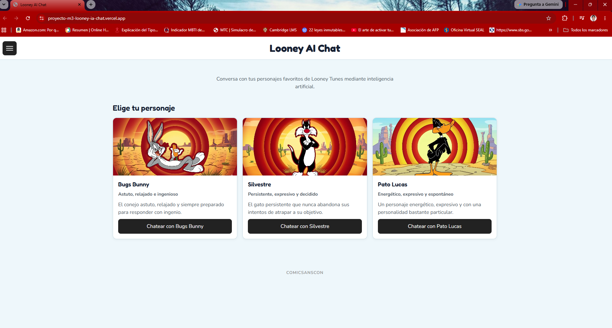
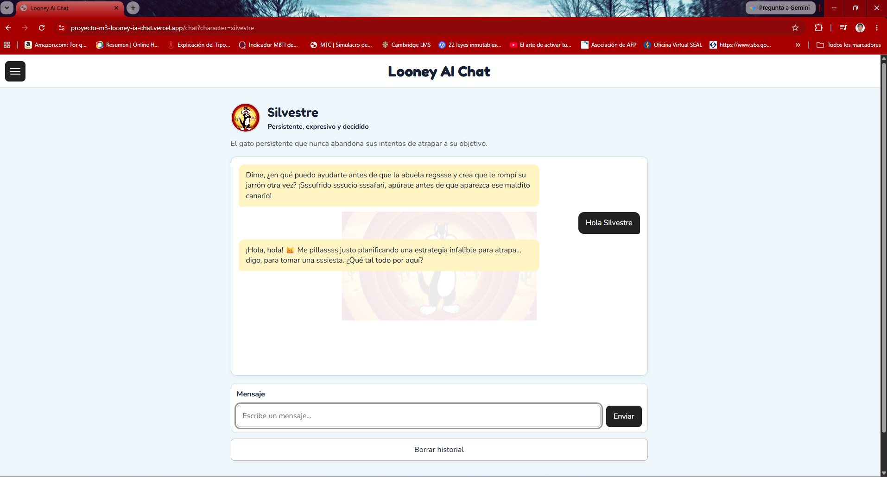
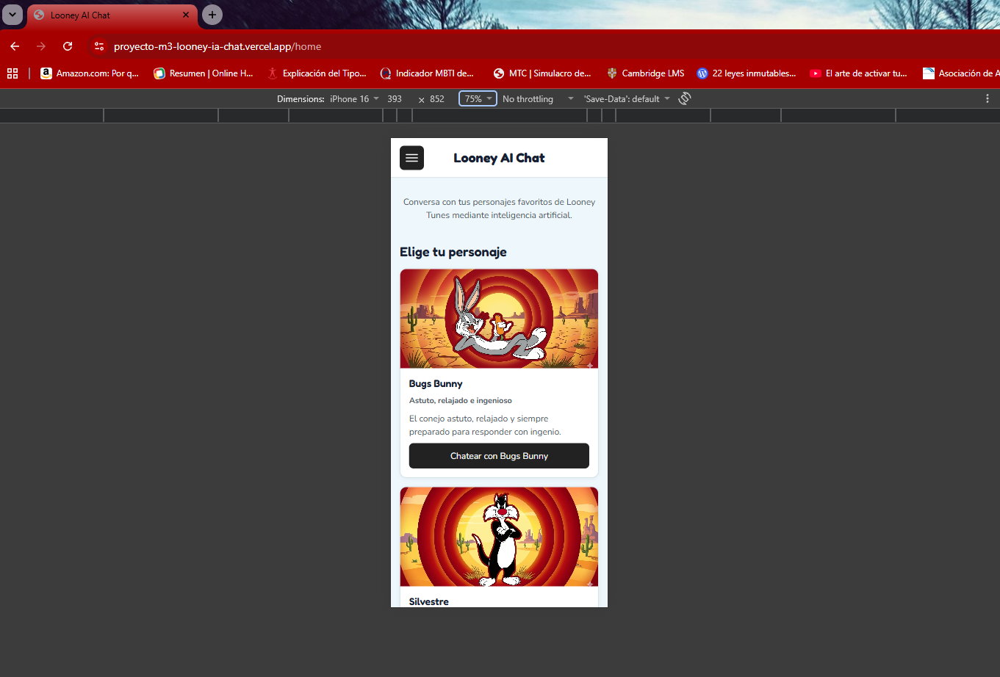
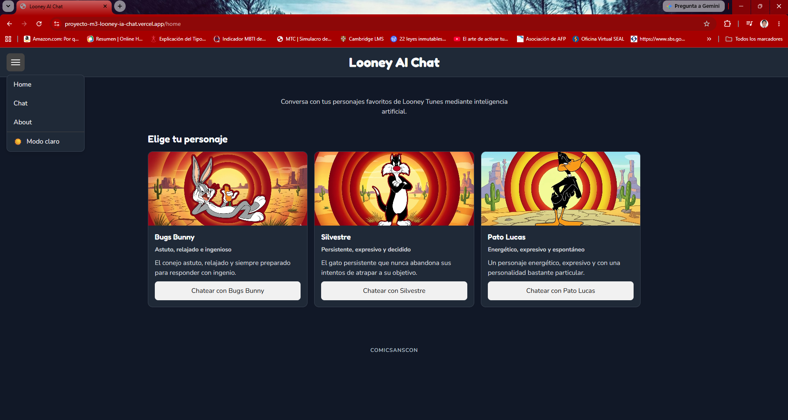

# Looney AI Chat

Aplicación web independiente que presenta una experiencia de chat con personajes de **Looney Tunes** mediante una integración con inteligencia artificial. El proyecto fue desarrollado como una **POC (Proof of Concept)**, utilizando una arquitectura sencilla y fundamentos de software orientados a demostrar una experiencia funcional y permitir su posible evolución futura.

## 🔗 Enlaces del proyecto

- **Demo en Vercel:** [Looney AI Chat](https://proyecto-m3-looney-ia-chat.vercel.app/)
- **Repositorio en GitHub:** [Proyecto-M3_Looney_IA_chat](https://github.com/mllopezc-cmd/Proyecto-M3_Looney_IA_chat)

---

El proyecto fue desarrollado como una **POC**, con una arquitectura proporcional a su alcance y enfocada en demostrar conceptos de desarrollo web, navegación SPA, manejo de estado en el navegador, persistencia local, integración con una API externa, validaciones, pruebas automatizadas y despliegue en Vercel.

## Presentación

**Looney AI Chat** permite seleccionar un personaje y acceder a una conversación independiente mediante una interfaz de chat.

Actualmente se encuentran disponibles:

- Bugs Bunny
- Silvestre
- Pato Lucas

Cada personaje cuenta con información propia, como descripción, personalidad y saludo inicial.

Las conversaciones se almacenan en `localStorage`, permitiendo conservar un historial independiente para cada personaje dentro del navegador.

La aplicación integra **Gemini** mediante una función backend ubicada en `api/functions.js`. La clave de API se mantiene como variable de entorno y no se expone directamente en el frontend.

> **Nota:** El proyecto es una POC independiente orientada a demostrar una experiencia de software funcional y una base tecnológica susceptible de evolución. No pretende reproducir oficialmente a los personajes ni representa una arquitectura de producción definitiva.

## Aviso del proyecto

**Looney AI Chat es un proyecto independiente y no oficial desarrollado con fines educativos y demostrativos.**

Los nombres, personajes y elementos relacionados con **Looney Tunes** pertenecen a sus respectivos propietarios.

El proyecto no pretende representar, sustituir ni reproducir una aplicación oficial de Looney Tunes.

La implementación utiliza estos personajes como parte del contexto de una POC de desarrollo web e integración con inteligencia artificial.

## Capturas de pantalla

### Home — escritorio



### Chat — escritorio



### Home — vista móvil



### Home — modo oscuro



## Características actuales

- Navegación entre las secciones **Home**, **Chat** y **About**.
- Navegación SPA mediante History API.
- Menú de navegación desplegable mediante icono de tres líneas.
- Cierre automático del menú después de seleccionar una sección.
- Cierre del menú al hacer clic fuera de él.
- Estados ARIA para mejorar la accesibilidad del menú.
- Modo claro y modo oscuro integrado dentro del menú de navegación.
- Persistencia de la preferencia de tema mediante `localStorage`.
- Selección de personajes desde Home.
- Tarjetas de personajes completamente seleccionables.
- Navegación directa desde cada tarjeta hacia el chat del personaje.
- URLs independientes para cada conversación.
- Historial independiente para cada personaje.
- Persistencia de conversaciones mediante `localStorage`.
- Recuperación de conversaciones existentes.
- Panel de **Mis conversaciones**.
- Visualización del último mensaje de cada conversación.
- Continuación de conversaciones existentes.
- Eliminación de la conversación del personaje seleccionado.
- Restauración del saludo inicial después de limpiar una conversación.
- Manejo de personajes no encontrados.
- Validación de mensajes vacíos o con espacios.
- Validación del tamaño máximo de los mensajes.
- Indicador visual de escritura durante la generación de respuestas.
- Animación del indicador mediante `Escribiendo.`, `Escribiendo..` y `Escribiendo...`.
- Bloqueo de nuevos envíos mientras se procesa una respuesta.
- Bloqueo temporal de la acción de limpiar el historial durante el procesamiento.
- Restauración de los controles después de una respuesta exitosa o fallida.
- Mensajes de error diferenciados según el tipo de problema de comunicación con la API.
- Watermark visual asociado al personaje seleccionado.
- Manejo controlado de errores de la API.
- Validación del historial enviado al backend.
- Límite de **2000 caracteres por mensaje**.
- Límite de **20 mensajes por historial enviado al backend**.
- Límite de **12000 caracteres acumulados por historial**.
- Validación de límites tanto en frontend como en backend.
- Integración con Gemini mediante `fetch`.
- Protección de la API key mediante variables de entorno.
- Protección del contenido renderizado mediante escape de HTML.
- Diseño responsive para dispositivos móviles, tablets y escritorio.
- Pruebas automatizadas con Vitest.
- Despliegue mediante Vercel.

## Rutas principales

| Ruta                        | Descripción                 |
| --------------------------- | --------------------------- |
| `/`                         | Página principal            |
| `/home`                     | Página principal            |
| `/chat`                     | Panel de conversaciones     |
| `/chat?character=bugs`      | Conversación con Bugs Bunny |
| `/chat?character=silvestre` | Conversación con Silvestre  |
| `/chat?character=lucas`     | Conversación con Pato Lucas |
| `/about`                    | Información del proyecto    |

## Persistencia de conversaciones

Las conversaciones se almacenan localmente mediante `localStorage`.

Cada personaje mantiene su propio historial, por lo que las conversaciones de Bugs Bunny, Silvestre y Pato Lucas no se mezclan.

También es posible:

- recuperar una conversación existente;
- continuar una conversación desde el panel de Chat;
- visualizar el último mensaje registrado;
- limpiar la conversación del personaje seleccionado;
- conservar el historial al navegar entre las diferentes secciones;
- restaurar correctamente el historial asociado al personaje seleccionado;
- conservar el historial después de recargar la aplicación.

La aplicación valida la estructura básica del historial recuperado para evitar que datos inválidos almacenados en `localStorage` provoquen errores durante el funcionamiento.

La interfaz diferencia entre:

- **Iniciar conversación**, cuando el personaje no tiene historial;
- **Continuar conversación**, cuando existe una conversación previa.

## Integración con Gemini

La aplicación utiliza Gemini para generar las respuestas de los personajes.

La integración se encuentra en:

```text
api/functions.js
```

El frontend envía el identificador del personaje y el historial de conversación a la función backend.

La función backend:

- valida el método HTTP;
- valida el personaje solicitado;
- valida que el historial sea un arreglo con mensajes válidos;
- valida que cada mensaje tenga un remitente permitido;
- valida que los mensajes contengan texto;
- valida el límite de caracteres por mensaje;
- valida el número máximo de mensajes;
- valida el límite total de caracteres del historial;
- obtiene `GEMINI_API_KEY` desde las variables de entorno;
- construye las instrucciones del personaje;
- transforma el historial al formato requerido por Gemini;
- envía la conversación a Gemini;
- procesa la respuesta;
- devuelve la respuesta generada al frontend;
- maneja los errores de la API.

La clave de API no se almacena en el código frontend ni se incluye directamente en el repositorio.

No se utiliza un SDK adicional de Google para la integración. La comunicación se realiza mediante `fetch`, manteniendo la arquitectura sencilla de la POC.

### Límites de las solicitudes

Para evitar solicitudes excesivamente grandes, la aplicación utiliza los siguientes límites:

```text
Máximo por mensaje:       2000 caracteres
Máximo de mensajes:       20
Máximo de caracteres:     12000
```

El frontend limita el historial enviado al backend sin eliminar el historial completo almacenado localmente.

El backend vuelve a validar estos límites antes de realizar la solicitud a Gemini. De esta manera, las restricciones no dependen exclusivamente del frontend.

Las solicitudes que incumplen estas restricciones se rechazan antes de realizar una petición al servicio externo.

### Manejo de errores

La interfaz muestra mensajes controlados según el tipo de error:

- **429:** se informa que el servicio alcanzó temporalmente su límite de uso.
- **500/502:** se informa que el servicio de IA no está disponible en ese momento.
- **Error de conexión:** se informa que no fue posible conectar con el servicio.
- **Otros errores:** se muestra un mensaje general para volver a intentar la operación.

Los detalles técnicos permanecen en la consola del navegador o del backend para facilitar la depuración sin exponer información técnica innecesaria al usuario.

Durante las pruebas automatizadas no se realizan solicitudes reales a Gemini. Las respuestas del servicio externo son simuladas mediante mocks.

## Testing

El proyecto utiliza **Vitest** para las pruebas automatizadas.

### Estado final

- **3 archivos de pruebas**
- **72 pruebas**
- **72 pruebas aprobadas**
- **0 pruebas fallidas**
- **0 errores no controlados**

Los archivos de pruebas son:

- `tests/app.test.js`
- `tests/utils.test.js`
- `tests/api.test.js`

Las pruebas cubren principalmente:

- datos de personajes;
- rutas y navegación;
- renderizado del chat;
- saludos iniciales;
- envío de mensajes;
- validación de mensajes vacíos;
- límites de longitud de mensajes;
- persistencia en `localStorage`;
- independencia entre conversaciones;
- recuperación de conversaciones;
- limpieza del historial;
- navegación SPA;
- funciones utilitarias;
- escape de contenido HTML;
- comportamiento del menú de navegación;
- estados ARIA del menú;
- cierre del menú durante la navegación;
- tarjetas de personajes completamente seleccionables;
- indicador de carga;
- bloqueo de nuevos envíos durante el procesamiento;
- restauración de controles después de una respuesta;
- manejo de errores durante la comunicación con la API;
- validación del método HTTP del backend;
- validación de personajes;
- validación de la estructura del historial;
- límite de 2000 caracteres por mensaje;
- límite de 20 mensajes por historial;
- límite de 12000 caracteres acumulados;
- respuestas de error del backend;
- respuestas simuladas de Gemini.

El comando utilizado para la validación final es:

```bash
npm test
```

Resultado final validado:

```text
✓ tests/utils.test.js (8 tests)
✓ tests/app.test.js (54 tests)
✓ tests/api.test.js (10 tests)

Test Files  3 passed (3)
Tests       72 passed (72)
```

Además de las pruebas automatizadas, se realizó una validación manual de:

- navegación entre las rutas;
- selección de personajes;
- tarjetas completamente seleccionables;
- conversaciones independientes;
- recuperación del historial;
- limpieza de conversaciones;
- diseño responsive;
- modo claro y oscuro;
- menú de navegación;
- estados del menú;
- perfil de los personajes;
- watermark;
- indicador de escritura;
- página About;
- casos límite principales;
- navegación Back/Forward;
- comportamiento del chat durante el procesamiento;
- manejo visual de errores;
- persistencia de conversaciones;
- funcionamiento de las rutas con `character`;
- comportamiento de la aplicación desplegada.

## Tecnologías

- HTML
- CSS
- JavaScript
- Vitest
- Vercel
- `localStorage`
- Gemini API mediante `fetch`

El proyecto mantiene una arquitectura deliberadamente sencilla para facilitar su comprensión, mantenimiento y evolución como base de software.

## Estructura principal

```text
Looney AI Chat/
├── api/
│   └── functions.js
├── src/
│   ├── app.js
│   ├── assets/
│   │   └── characters/
│   │       ├── bugs-bunny.webp
│   │       ├── silvestre.webp
│   │       └── pato-lucas.webp
│   ├── chat.js
│   ├── index.html
│   ├── styles.css
│   └── utils.js
├── tests/
│   ├── api.test.js
│   ├── app.test.js
│   └── utils.test.js
├── .env.example
├── .gitignore
├── package.json
├── package-lock.json
├── README.md
└── decisiones.md
```

### Responsabilidad de los principales archivos

- `src/app.js`: navegación SPA, renderizado de Home, About, panel de conversaciones y elementos generales de la aplicación.
- `src/chat.js`: lógica de personajes, conversaciones, persistencia, validaciones y comunicación con la API.
- `src/utils.js`: funciones utilitarias, comunicación HTTP y escape de contenido HTML.
- `src/styles.css`: estilos, modo claro/oscuro, estados visuales y diseño responsive.
- `src/index.html`: estructura HTML inicial de la aplicación.
- `api/functions.js`: integración backend con Gemini y validación de las solicitudes.
- `tests/app.test.js`: pruebas de aplicación, navegación y chat.
- `tests/utils.test.js`: pruebas de funciones utilitarias.
- `tests/api.test.js`: pruebas del endpoint backend, validaciones de entrada, límites del historial y manejo de respuestas de Gemini.
- `src/assets/characters/`: imágenes locales utilizadas para representar a los personajes.

## Instalación

Clonar el repositorio y acceder al directorio del proyecto:

```bash
git clone <repositorio-de-GitHub>

cd Proyecto-M3_Looney_IA_chat
```

Instalar las dependencias:

```bash
npm install
```

## Ejecución y testing

Para ejecutar las pruebas automatizadas:

```bash
npm test
```

Para realizar la validación mediante el entorno local de Vercel:

```bash
npx vercel dev
```

## Variables de entorno

El proyecto incluye un archivo `.env.example` como referencia:

```env
GEMINI_API_KEY=
```

Para ejecutar la integración con Gemini se debe configurar la variable `GEMINI_API_KEY` en el entorno correspondiente.

La clave real **no debe incluirse en el repositorio**.

## Despliegue

El proyecto se encuentra desplegado en **Vercel**.

Durante la validación del deployment se revisaron los principales flujos de la aplicación, incluyendo:

- navegación entre Home, Chat y About;
- selección de personajes;
- conversaciones independientes;
- integración con Gemini;
- persistencia del historial;
- recuperación de conversaciones;
- rutas con `character` mediante query string;
- navegación mediante Back/Forward;
- funcionamiento de la aplicación desplegada.

Durante la validación local con `npx vercel dev` se observó que una recarga directa de determinadas rutas internas podía devolver `404`.

Este comportamiento se contrastó posteriormente con el deployment de Vercel. La aplicación desplegada funciona correctamente mediante su navegación SPA y las rutas internas utilizadas por el proyecto.

Por este motivo, no fue necesario incorporar un archivo `vercel.json` ni reglas de rewrite adicionales.

**Vercel:** [Looney AI Chat](https://proyecto-m3-looney-ia-chat.vercel.app/)

## Documentación

La documentación principal del proyecto se concentra en los siguientes archivos:

- [`README.md`](README.md) — presentación general, características, arquitectura, instalación, testing y estado final.
- [`decisiones.md`](decisiones.md) — principales decisiones tomadas durante el desarrollo y los criterios utilizados para mantener una arquitectura sencilla.

Ambos documentos se consideran parte de la documentación final del proyecto.

## Estado final del proyecto

- [x] Desarrollo de la estructura inicial
- [x] Implementación de la navegación SPA
- [x] Implementación del chat
- [x] Persistencia de conversaciones
- [x] Separación de historiales por personaje
- [x] Mejoras visuales y responsive
- [x] Menú de navegación desplegable
- [x] Modo claro y oscuro
- [x] Tarjetas de personajes completamente seleccionables
- [x] Indicador de escritura
- [x] Bloqueo durante el procesamiento de mensajes
- [x] Manejo de errores de la comunicación con la API
- [x] Validaciones de frontend y backend
- [x] Límites de mensajes e historial
- [x] Protección del contenido renderizado
- [x] Implementación de pruebas automatizadas
- [x] Pruebas del backend
- [x] Integración con Gemini
- [x] Validación automática
- [x] Validación manual
- [x] Revisión final del código
- [x] Revisión final de documentación
- [x] Preparación para despliegue en Vercel
- [x] Validación del deployment
- [x] Documentación de decisiones técnicas
- [x] Commit final del código
- [x] Push final del código

## Consideraciones de la validación local

Durante la validación con `npx vercel dev`, la navegación interna de la SPA funcionó correctamente.

Inicialmente se observó que una recarga directa mediante `F5` sobre rutas como `/chat` o `/chat?character=...` podía responder con `404` en el entorno local.

Este comportamiento fue contrastado con el deployment de Vercel.

La aplicación desplegada funciona correctamente mediante la navegación interna de la SPA y las rutas utilizadas por el proyecto.

Por este motivo, no fue necesario agregar `vercel.json` ni otra configuración adicional para solucionar el comportamiento observado exclusivamente durante la ejecución local de `vercel dev`.

Esta particularidad queda documentada como una diferencia observada entre el entorno local de desarrollo y el deployment utilizado para la validación.

## Enfoque del proyecto

El objetivo del proyecto es desarrollar una aplicación funcional, comprensible y mantenible, utilizando una arquitectura proporcional al alcance de la POC y dejando una base preparada para futuras iteraciones.

Por esta razón se priorizaron:

- código sencillo;
- separación clara de responsabilidades;
- pocas dependencias;
- pruebas automatizadas;
- persistencia local;
- integración backend mínima;
- validaciones en frontend y backend;
- protección básica del contenido renderizado;
- manejo controlado de errores;
- cambios controlados;
- facilidad de mantenimiento y explicación.

La integración con Gemini se implementó mediante una función backend sencilla y `fetch`, evitando agregar dependencias innecesarias.

Las imágenes de los personajes se mantienen como recursos locales dentro de `src/assets/characters/`, evitando dependencias externas para su presentación visual.

El proyecto queda **finalizado como una POC independiente de desarrollo de software**, con frontend, navegación SPA, persistencia local, conversaciones independientes por personaje, pruebas automatizadas, validaciones backend, integración con inteligencia artificial y deployment en Vercel.

Su estructura permite utilizarlo como base para futuras iteraciones y una eventual evolución hacia un producto, manteniendo una arquitectura proporcional al alcance actual y evitando complejidad prematura.

**Estado final:** proyecto desarrollado, validado, documentado, versionado y desplegado.
